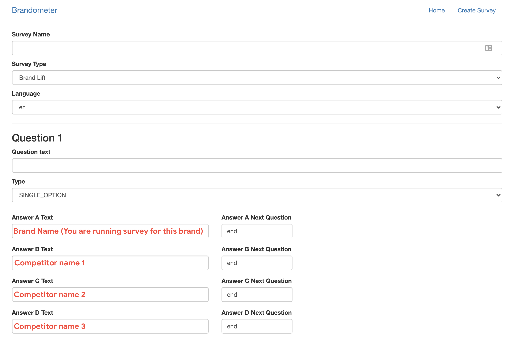
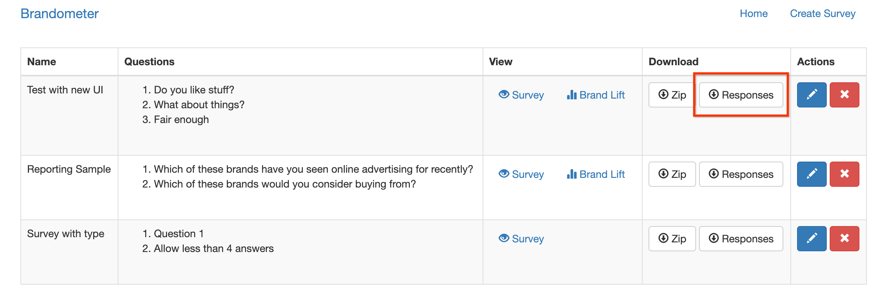

# Brandometer

N.B. This is not an officially supported Google product

For the marketers, Brandometer is a solution to measure brand impact through inexpensive and automated deployment of brand studies not yet offered by existing Google Display products.

To check out the Java implementation, you can check this [branch](https://github.com/google/brandometer/tree/release-v1.0) or this [release](https://github.com/google/brandometer/releases/tag/v1.0)

For developers, check out [DEVELOPERS.md](DEVELOPERS.md)

# Prerequisites

This solution leverages:
* [Google Cloud SDK](https://cloud.google.com/sdk/) (aka gcloud)
* [Python 3.x](https://www.python.org/downloads/)
* [pip](https://bootstrap.pypa.io/get-pip.py)

# Quick start to deployment

1. Create a [Google Cloud project](https://console.cloud.google.com/projectcreate) with billing enabled.
   Take note of the project id.

2. Download source code from [github](https://github.com/google/brandometer) on your workstation. 

```shell
   git clone https://github.com/google/brandometer.git
```
3. Set up project with gcloud

Run command: `gcloud auth login`. It will pop up a new login page to authorize your account

4. After login, set up the project config to your working PROJECT_ID 

```shell
   gcloud config set project $YOUR_PROJECT_ID
```

5. ```./deploy [project-id] [bigquery-location] [compute-region]```

Use these commands to find possible values for:

bigquery-location: `gcloud functions regions list`

compute-region: `gcloud app regions list`

If the deploy fails with an error, wait 5 minutes and try again. Sometimes a new project takes a little while to set up.

# Survey Creation

1. Open Brandometer project and click on "Create survey"
2. Input details (check below) then submit

3. In the home page, download the zip file which will have 2 HTML5 creatives “Control & Expose” for Brand lift surveys and only one creative for Brand track surveys (only survey no lift)
4. Use both the creatives to run a Brand lift survey or only one of the two creatives to run a Brandtrack survey on Display only inventory through DV360.

# Campaign Manager setup

1. Create a new campaign in DCM within the Advertiser (No other channel should be part of this)
2. Create Brandometer Audiences within the campaign with Control(wt:1) and Expose(wt:7) Segments (See Below)
   a. Navigation: Campaign -> Property -> Audience segmentation
3. Create a placement within the Campaign with the naming convention containing the dimensions. NOTE: Brand-O-Meter setup will happen for 300x250 dimension.
4. Upload all the survey creatives/default creatives
5. Default Ad should be assigned to all placements (Use brand neutral creative[Its a creative that does not have any brand related comms/logos/names etc] for default ads 
6. Create a Control Survey Ad and assign it to 300x250 placement with following details
   a. Priority:9
   b. Assign the Control survey creative
   c. Assign Audience Segment: Control
   d. Frequency: 2/3
7. Create a Pre-Survey Ad and assign to all placements
   a. Assign priority 9
   b. Assign Frequency Cap: 2/3
   c. Assign the 300x250 brand creative
   d. Assign Audience segment: Expose
8. Create an Expose Survey based on nomenclature and assign the respective Expose Survey creative.
   a. Assign Priority: 10
   b. Assign Expose survey creative
   c. Assign Audience Segment: Expose
   d. Frequency: 2/3
9. Create a Master ad for both placements that will have DCO creative assigned to it.
   a. Assign Priority: 15
   b. Assign brand creative
   c. No Audience segment.
   d. No Fcap

## Summary:
1. Backup images can be any jpg brand creatives for respective dimensions.
2. No of placements: 1
3. No of ads for 300x250: 5
4. Each Brandometer placement will have : Default, pre-survey(expose audience), Expose survey, control survey, Master ads.

*300x250 Dimension*
| Ad type | Creative type | Audience | Frequency | Priority |
| --- | --- | --- | --- | --- |
| Defaultt Ad | Brand neutral | - | - | - |
| Control Ad | Control survey | Control | >2 | 9 |
| Pre-Survey Ad | Brand creative | Expose | >2 | 9 |
| Expose Survey Ad | Expose survey | Expose | >2 | 10 |
| Master Ad | Brand creative | - | - | 15 |

# DV360 setup
1. Assign the creatives synced from CM to respective LI items.
2. Each BOM cut/creative will have to be assigned in a separate LI. i.e. If you have Male & Female cuts then you will have 2 placements in CM and respective 2 Line items in DV360.

# Reporting
Use [this template](https://docs.google.com/spreadsheets/d/1hMe8AdjjzDHPUO9y9J3vZpDmGkPLzbiNpc6b_iAfl-k/edit?usp=sharing) to add responses & generate lift
Sample report [here](https://docs.google.com/spreadsheets/d/1aRtO7PdeXqrjC9J8ItmEPkK012c2JIzRGDbPIyI8OQI/edit?usp=sharing).

# Download Responses
To download the responses, go to the homepage and click on the Download
Responses button. The responses will be downloaded in the form of a csv.


# FAQ
1. Can we have multiple questions?
Yes
2. Should we use “Brand name “ as option “A” & option B onwards competitor names?
Yes.
3. Can we run multiple cuts like male female separately to check the lift?
Yes, please setup multiple surveys to do so. Each cut will have a separate placement with 5 ads in CM for Brand lift study & respective Line items in DV360.
